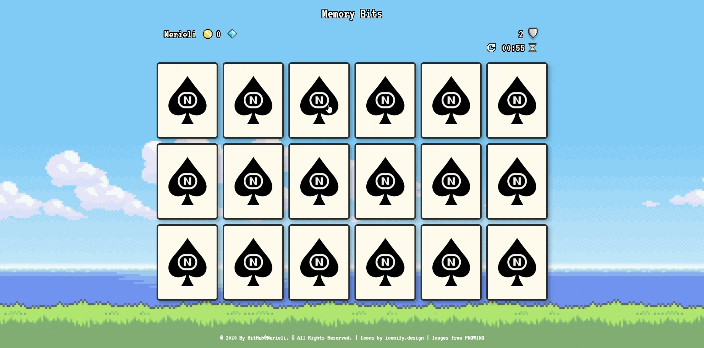
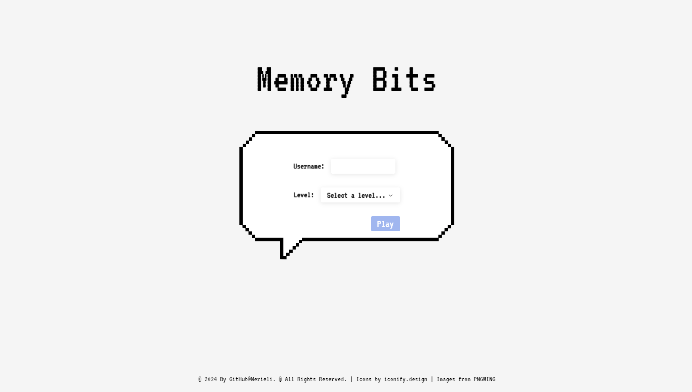
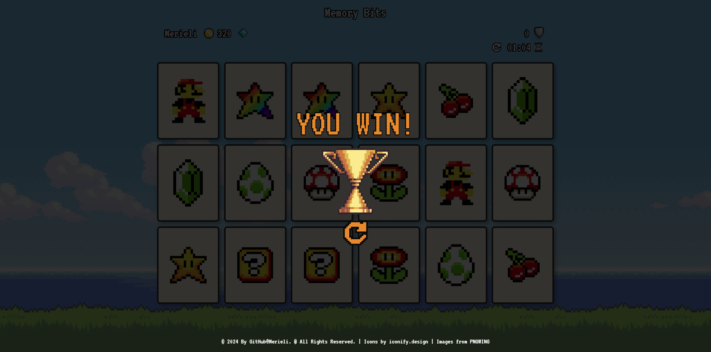
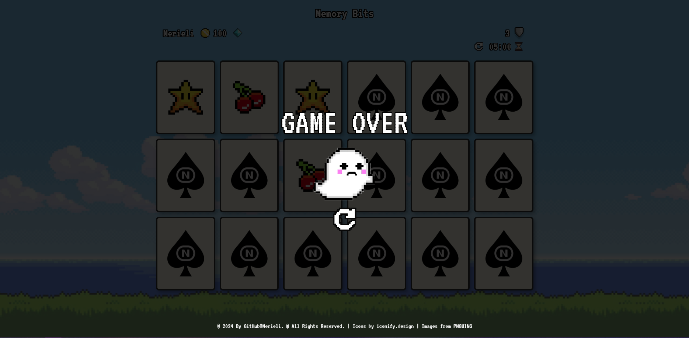

<h1 align="center">
    <br>
    
    <br><br>
    Memory Bits
</h1>

<p align="center">
    Pixel art memory game, a fullstack web app, with database and API. It has a login that records game data per user and the easy, medium and difficult levels.
    <br><br>
    <a href="https://opensource.org/licenses/MIT">
        
    </a>
    <br><br>
</p>

[*🎯 Roadmap*](./ROADMAP.todo)

## ✨ Features

- Multi devices
- API REST
- CRUD in the database
- Fullstack app


## 📸 Preview



<div style="display: flex; gap: 5px; justify-content: center;">
  
  
  
</div>


<br>

## ⚡ Tech Stack

 Nuxt,  TypeScript,  Tailwind, 🍍 Pinia, Radix Vue, Zod, Prisma, MySQL


<br>

## 🗂 How to Use

To clone and run this application, you'll need [Git](https://git-scm.com) and [Node.js](https://nodejs.org) (which comes with npm) installed on your computer. From your command line:

```bash
# Clone the project
  git clone https://github.com/Merieli/memory-bits.git
```

1. In the root directory `/`.
  Configure the `.env` file with the same variables as the `/.env.example` file

2. In the `/project` directory.
  Configure the `.env` file with the same variables as the `/project/.env.example` file

3. In the root directory `/` run MySQL database with Docker
```bash
# Execute the docker container
docker compose up -d

# Execute the container with bash
docker exec -it memorygame-db bash

# Access the MySQL terminal
mysql -uroot -p
# Later enter the password and use the Database
```

4. Run Locally
```bash
# Go to the project directory
  cd project/

# Install dependencies
  npm install

# Start the server
  npm run dev
```

## :octocat: Contributing

This project is for study purposes, so contact me and let me know your ideas.
All kinds of contributions are very welcome and appreciated!

- ⭐️ Star the project
- 🐛 Find and report issues
- 📥 Submit PRs to help solve issues or add features
- ✋ Influence the future of project with feature requests

-------------------------------------
```diff
Made by 🤍 Merieli Manzano
```

<p align="right">(<a href="#top">back to top</a>)</p>
